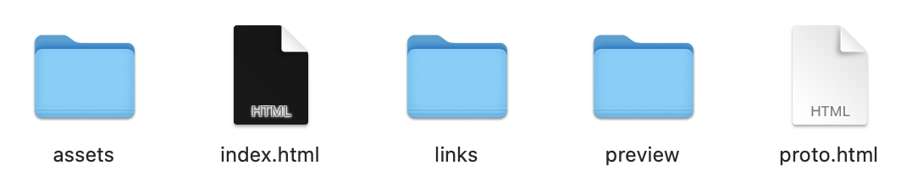
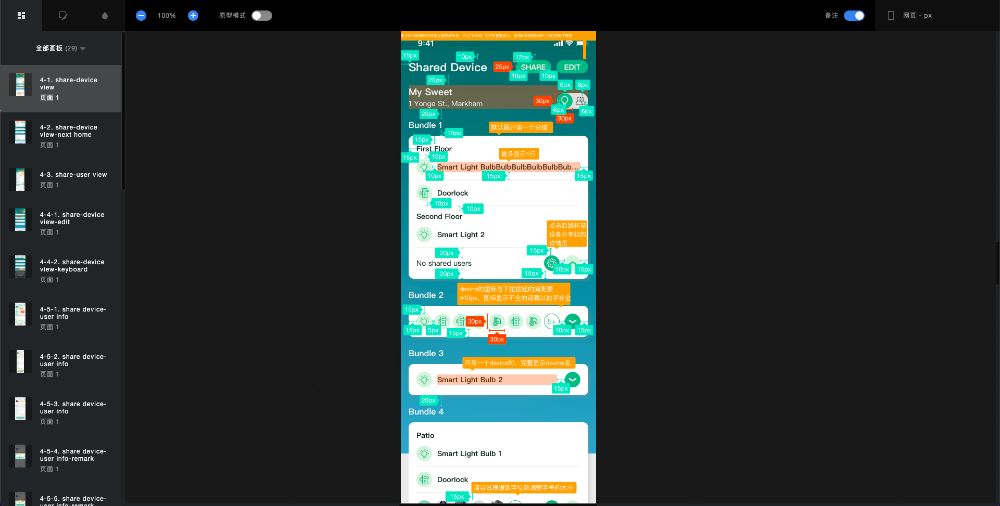

# UI 相关说明

---

## 设计图

- ##### 设计图会在[Jira](https://www.atlassian.com/software/jira)上以 Ticket 的形式提供，如下图

  > **注：** Ticket 中会同时补充一些说明信息，请注意查看

  

- ##### 下载并解压后会得到如下文件

  

- ##### 打开 `index.html` 后会看到如下设计图界面

  

- ##### 点击某一项后会在右面得到详细的信息，包括 **背景颜色**，**圆角**，**阴影**，**不透明度**，**字体大小**，**字号**，**字重** 等相关信息，如下图

  > **注：** 请严格遵照设计图上所标注的信息来进行 UI 布局，包括所有 **背景颜色**，**圆角**，**阴影**，**不透明度**，**页面间距**，**字体大小**，**字号**，**字重** 等。如果遇到最终实现效果与设计图不一致，或无法实现的情况，请及时与产品经理沟通进行调整

  

---

## 工程文件

- ##### 多语言支持

  ```
  XtrmTekAPP
  │  ...
  └───src
  │   │   ...
  │   └───lang
  │       │   en-us.js
  │       │   zh-cn.js
  └───...
    │  ...
  ```

  `en-us.js` `zh-cn.js` 两个文件为多语言文本配置文件，设计图中的所有固定文本均要写入此文件之中 <br/>

  **具体配置方法如下**

  ```
  export default {
    welcome: {
        launch: 'WELCOME TO SMART HOME',
    },
  ...
  };
  ```

  **在页面中的调用方法如下**

  ```
  <Text>
    {I18n.t('welcome.launch')}
  </Text>
  ```

- ##### Layout 文件

  ```
  XtrmTekAPP
  │  ...
  └───src
  │   │   ...
  │   └───Constants
  │       │   ...
  │       │   Layout.js
  └───...
    │  ...
  ```

  `Layout.js`文件为常用的 UI 样式配置文件，其中包含了常用的**颜色**，**字号**，**字重**，**阴影**等。如果 UI 设计图中的样式为通用样式，请务必从此文件中调用，以便日后的统一修改
